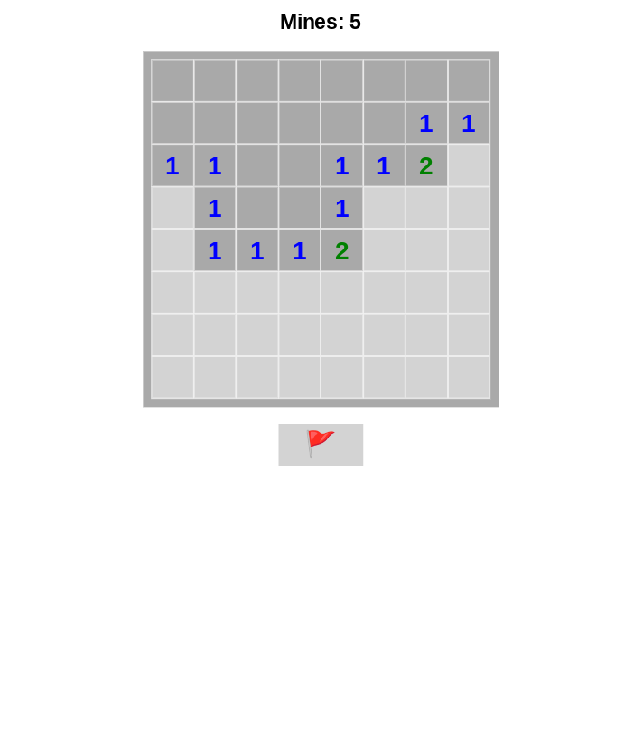
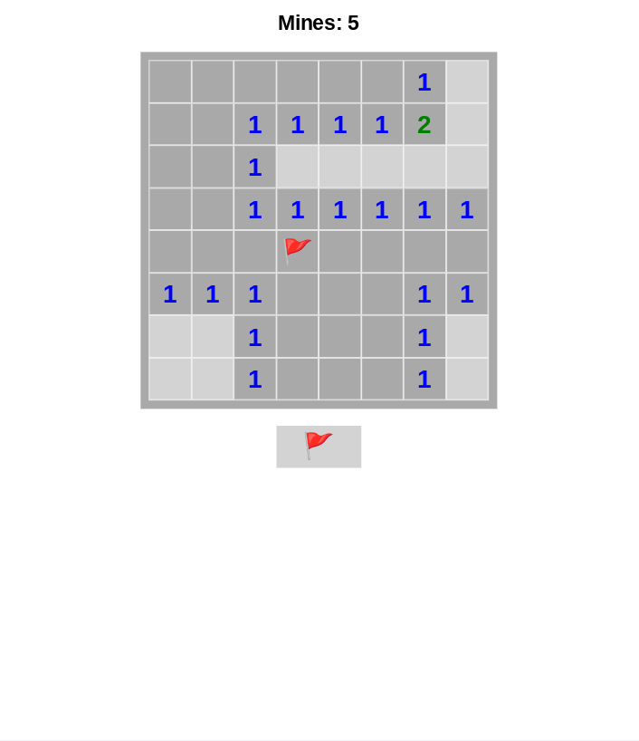

# Minesweeper

Completed result from [YouTube Tutorial](https://youtu.be/AfhfAxKFP-s) with video's challenge completed and reworked logic so that the game cannot end on first click. 

## Table of Contents

- [Screenshots](#screenshots)
- [Link](#link)
- [Thoughts](#thoughts)
- [Useful Resources](#useful-resources)
- [Acknowledgements](#acknowledgements)

## Screenshots

## Link

- [Github Pages](https://jdegand.github.io/minesweeper)

## Thoughts

While researching the odin project's battleship challenge, I thought I could learn a lot by checking out how to code minesweeper. 
There is a lot of similarities between minesweeper and battleship - using nested for-loop for creating the board, 3 checks for each cell, counts, random placement, having a main game loop function, etc.

## Continued Development

- Use level system- instead of a number input on start screen, radio buttons for predetermined amount of bombs (5, 10, 20) etc
- A timer could be used and also tied to a level system
- LocalStorage to save game state 
- Input type number always has weird issues - better to change to text ?
- Flag implementation is superficial - you still can click on that square and lose.  
- Does flag prevent clicking in original? Yes.  
- Can't remove flag inside of recursive effect
- CheckTile function probably contains too much logic - break out flag functionality into separate function tied to right click ?

## Useful Resources

- [Medium](https://evayde.medium.com/when-and-why-to-remove-event-listeners-in-javascript-cc7a19cb5072) - when and why to remove event listeners
- [Stack Overflow](https://stackoverflow.com/questions/56310170/how-to-solve-the-problem-of-stepping-on-mine-the-first-step-clicking-in-mineswee) - first click landing on mine
- [Stack Overflow](https://stackoverflow.com/questions/32936352/html-number-input-min-and-max-not-working-properly) - max not working correctly
- [Harvard](https://dash.harvard.edu/bitstream/handle/1/14398552/BECERRA-SENIORTHESIS-2015.pdf) - algorithmic approaches to minesweeper
- [Reddit](https://www.reddit.com/r/Minesweeper/comments/cw3oyp/what_is_the_best_number_of_mines_for_10x10_board/) - best number of mines for 10 x 10 board
- [Medium](https://medium.com/@bigcatplichta/javascript-use-bind-to-dynamically-add-and-remove-event-listeners-d6b443877a73) - event listeners
- [Birrell](http://birrell.org/andrew/minesweeper/) - minesweeper js
- [Stack Overflow](https://stackoverflow.com/questions/4235426/how-can-i-capture-the-right-click-event-in-javascript) - right click in js

## Acknowledgements

- [ImKennyYip](https://github.com/ImKennyYip) 
